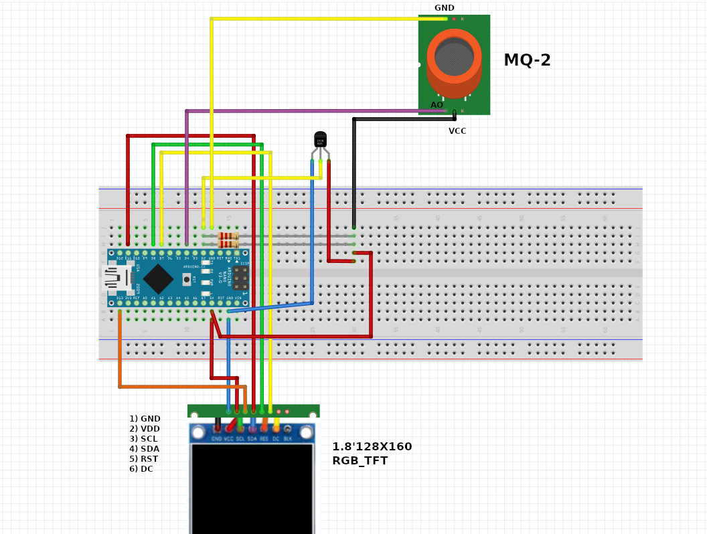
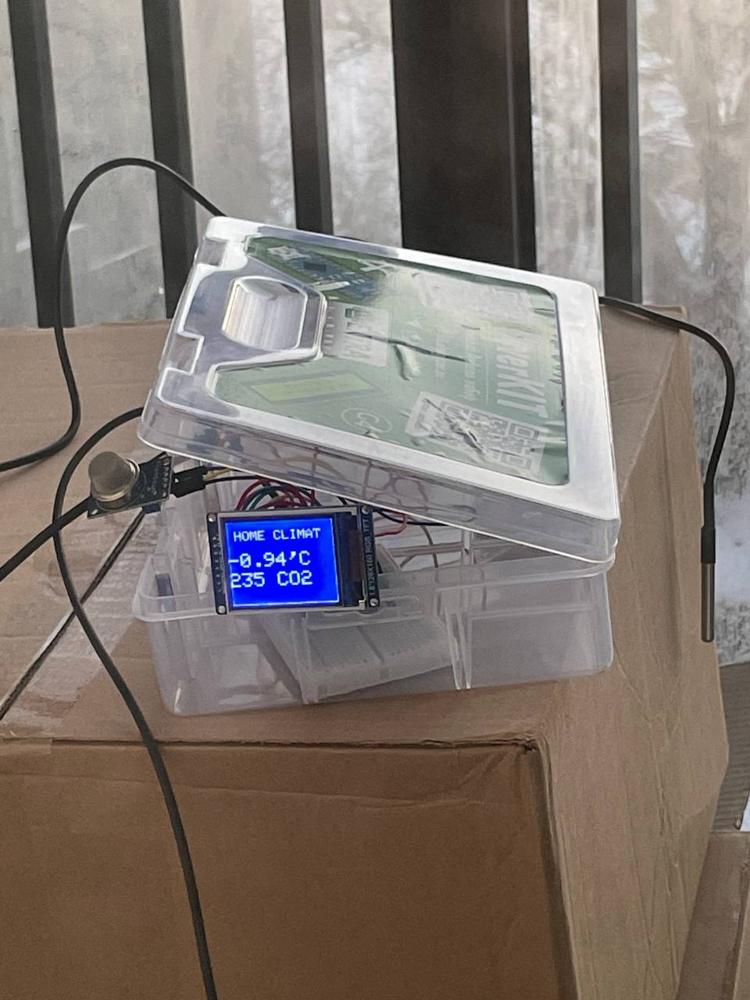

##Станция, отображающая температуру в комнате и показатель углекислого газа.

Компоненты:
- Arduino nano (type-c)
- MQ-2 sensor CO2
- DS18B20 sensor temperature
- 1.8'128X160 RGB_TFT display 

Исходный код:

Схема:

Пример работы:

